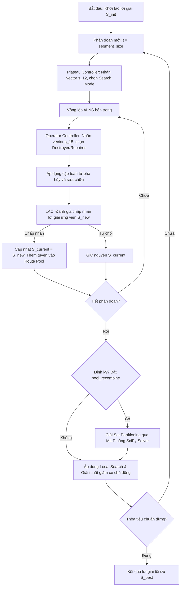

TỔNG LIÊN ĐOÀN LAO ĐỘNG VIỆT NAM
TRƯỜNG ĐẠI HỌC TÔN ĐỨC THẮNG
---------------------------------

# CÔNG TRÌNH NGHIÊN CỨU KHOA HỌC SINH VIÊN
## NĂM HỌC 2025 - 2026

 
 

## TÊN ĐỀ TÀI:
# NGHIÊN CỨU VÀ TỐI ƯU HÓA BÀI TOÁN ĐỊNH TUYẾN PHƯƠNG TIỆN CÓ KHUNG THỜI GIAN (VRPTW) BẰNG THUẬT TOÁN TÌM KIẾM LÂN CẬN LỚN THÍCH ỨNG LAI HỌC TĂNG CƯỜNG SÂU (DDQN-ALNS)

 
 
 

**ĐƠN VỊ:** KHOA ĐIỆN - ĐIỆN TỬ
**GIẢNG VIÊN HƯỚNG DẪN:** PGS. TS. TRẦN HOÀNG NAM
**SINH VIÊN THỰC HIỆN:** NGUYỄN VĂN A
**MÃ SỐ SINH VIÊN:** 10020130

 
 
 
 
 

### TP. Hồ Chí Minh, tháng 5 năm 2026

---
*(Trang số thứ tự: 1 - Vị trí: Chính giữa phía trên đầu trang)*

## TÓM TẮT CÔNG TRÌNH

Bài toán định tuyến phương tiện có khung thời gian (Vehicle Routing Problem with Time Windows - VRPTW) là một bài toán tối ưu hóa tổ hợp thuộc lớp NP-khó có tầm quan trọng đặc biệt trong chuỗi cung ứng logistics đô thị hiện đại. Nghiên cứu này đề xuất một thuật toán tối ưu lai mới mang tên **DDQN-ALNS**, kết hợp thuật toán Tìm kiếm lân cận lớn thích ứng (Adaptive Large Neighborhood Search - ALNS) truyền thống với Học tăng cường sâu (Deep Reinforcement Learning - DRL), cụ thể là kiến trúc Double Deep Q-Network (DDQN) và cơ chế ưu tiên lấy lại trải nghiệm (Prioritized Experience Replay - PER).

Mô hình lai đề xuất tích hợp hai cấp độ điều khiển học máy song song cùng với phương pháp tối ưu hóa toán học chính xác. Ở cấp độ chiến lược (Plateau Controller), mạng thần kinh Dueling Double DQN đánh giá trạng thái hội tụ của quá trình tìm kiếm để chọn chế độ tìm kiếm (Search Mode) thích hợp nhất trong số 6 chế độ hoạt động, giúp cân bằng giữa khai thác (exploitation) và khám phá (exploration). Ở cấp độ toán tử (Operator Controller), một mạng DDQN thứ hai sẽ học cách lựa chọn tối ưu cặp toán tử phá hủy và sửa chữa trong số 40 tổ hợp toán tử sẵn có để áp dụng tại từng vòng lặp. Để khắc phục giới hạn của Simulated Annealing truyền thống, cơ chế học điều kiện chấp nhận (Learned Acceptance Criterion - LAC) sử dụng mạng nơ-ron phân loại nhị phân được phát triển để dự đoán và quyết định việc chấp nhận lời giải ứng viên dựa trên trạng thái tiến trình tối ưu hóa. Hơn nữa, thuật toán tích hợp kho lưu trữ tuyến đường (Route Pool) và giải bài toán phân hoạch tập hợp (Set Partitioning) bằng Quy hoạch nguyên hỗn hợp (Mixed Integer Linear Programming - MILP) định kỳ để tái tổ hợp các tuyến đường tối ưu nhất.

Thực nghiệm diện rộng trên tập dữ liệu chuẩn Solomon (RC1 và RC2) cho thấy thuật toán **DDQN-ALNS** đạt kết quả vượt trội với độ lệch khoảng cách trung bình (Gap%) cực thấp chỉ **0.16%** so với lời giải tốt nhất đã biết (BKS), đồng thời tối thiểu hóa số lượng phương tiện vận hành vượt trội so với bộ giải thương mại Google OR-Tools. Khả năng tổng quát hóa của thuật toán cũng được chứng minh thông qua phương pháp ngẫu nhiên hóa miền dữ liệu (Domain Randomization), giúp mô hình chuyển giao (Transfer-DR) đạt Gap% chỉ **1.62%** trên Solomon mà không cần cập nhật trọng số trực tuyến. Cuối cùng, cổng thông tin điều phối trực quan tương tác (**NAMI**) được xây dựng dựa trên FastAPI để ứng dụng công trình vào thực tiễn doanh nghiệp.

---
*(Trang số thứ tự: 2 - Vị trí: Chính giữa phía trên đầu trang)*

# NỘI DUNG CÔNG TRÌNH NGHIÊN CỨU

## 1. Đặt vấn đề

Trong bối cảnh nền kinh tế số và thương mại điện tử phát triển mạnh mẽ, ngành dịch vụ hậu cần (logistics) đóng vai trò mạch máu của chuỗi cung ứng toàn cầu. Theo báo cáo của Hiệp hội Doanh nghiệp Dịch vụ Logistics Việt Nam, chi phí logistics tại Việt Nam hiện chiếm tỷ trọng khoảng 16,8% đến 17% GDP, cao hơn đáng kể so với mức trung bình toàn cầu. Trong số đó, chi phí vận tải đường bộ chiếm tới hơn 60% tổng chi phí logistics. Điều này đặt ra yêu cầu cấp thiết về việc tối ưu hóa lộ trình vận chuyển nhằm tiết kiệm nhiên liệu, giảm thời gian giao hàng và tối thiểu hóa số lượng phương tiện sử dụng, từ đó nâng cao năng lực cạnh tranh cho doanh nghiệp và giảm phát thải carbon gây ô nhiễm môi trường.

Bài toán định tuyến phương tiện có khung thời gian (Vehicle Routing Problem with Time Windows - VRPTW) là mô hình toán học phản ánh trực tiếp thách thức thực tế này. Trong VRPTW, một đội xe xuất phát từ một kho chứa trung tâm cần phục vụ một tập hợp khách hàng phân tán về địa lý. Mỗi khách hàng có nhu cầu hàng hóa xác định và yêu cầu phục vụ trong một khung thời gian $[E_i, L_i]$ cụ thể. Nếu xe đến trước $E_i$, tài xế phải chờ đợi; nếu đến sau $L_i$, lời giải hoàn toàn vi phạm ràng buộc và không hợp lệ. VRPTW thuộc lớp bài toán NP-khó (NP-hard), nghĩa là thời gian tìm kiếm lời giải tối ưu toán học sẽ tăng lên theo hàm mũ khi số lượng khách hàng tăng lên.

Mặc dù các thuật toán heuristic và meta-heuristic truyền thống như Tìm kiếm lân cận lớn thích ứng (ALNS) đã chứng minh được hiệu năng tốt trong việc giải quyết các bài toán kích thước trung bình và lớn, chúng vẫn phụ thuộc nặng nề vào các tham số được thiết lập thủ công và cơ chế điều khiển cứng nhắc. Sự kết hợp giữa các kỹ thuật học máy hiện đại, đặc biệt là Học tăng cường sâu (DRL), mở ra một hướng đi mới đầy triển vọng. DRL cho phép hệ thống tự học các chiến lược chọn toán tử tối ưu và tự động điều phối trạng thái tìm kiếm dựa trên kinh nghiệm tích lũy từ các vòng lặp trước đó. 

Do đó, đề tài *"Nghiên cứu và tối ưu hóa bài toán định tuyến phương tiện có khung thời gian (VRPTW) bằng thuật toán tìm kiếm lân cận lớn thích ứng lai học tăng cường sâu (DDQN-ALNS)"* được lựa chọn thực hiện nhằm phát triển một giải pháp tối ưu hóa thông minh vượt trội, giải quyết triệt để các ràng buộc khung thời gian ngặt nghèo và tối thiểu hóa quy mô đội xe hoạt động, góp phần hiện đại hóa công nghệ logistics tại Việt Nam.

---
*(Trang số thứ tự: 3 - Vị trí: Chính giữa phía trên đầu trang)*

## 2. Tổng quan tài liệu

Bài toán định tuyến phương tiện (VRP) được giới thiệu lần đầu bởi Dantzig và Ramser (1959). Kể từ đó, hàng loạt biến thể của bài toán đã được phát triển nhằm đáp ứng các yêu cầu thực tiễn, trong đó VRPTW là biến thể phổ biến nhất do tính thực tế cao của các ràng buộc về mặt thời gian (Solomon, 1987).

Để giải quyết VRPTW, các phương pháp tiếp cận trong lịch sử được chia làm ba nhóm chính:

1. **Phương pháp chính xác (Exact Methods):** Sử dụng các thuật toán như Quy hoạch động (Dynamic Programming), Nhánh và Cắt (Branch and Cut), hay Nhánh-Giá và Cắt (Branch-and-Price-and-Cut). Mặc dù các phương pháp này đảm bảo tìm ra lời giải tối ưu toàn cục, chúng gặp hạn chế lớn về khả năng mở rộng (scalability). Khi số lượng khách hàng vượt quá 100, thời gian tính toán tăng lên đến hàng giờ hoặc hàng ngày, khiến chúng không thể áp dụng cho các bài toán điều phối thời gian thực trong doanh nghiệp.

2. **Phương pháp Heuristic và Meta-heuristic:** Để đánh đổi độ tối ưu tuyệt đối lấy thời gian tính toán nhanh, các thuật toán tìm kiếm meta-heuristic như Giải thuật Di truyền (Genetic Algorithm), Tối ưu hóa bầy đàn (Particle Swarm Optimization), hay Tìm kiếm Tabu (Tabu Search) đã được áp dụng rộng rãi. Đặc biệt, thuật toán Tìm kiếm lân cận lớn thích ứng (ALNS), được đề xuất bởi Ropke và Pisinger (2006), đã trở thành chuẩn mực công nghiệp để giải quyết các bài toán định tuyến quy mô lớn. ALNS hoạt động bằng cách liên tục phá hủy một phần lời giải hiện tại và tái thiết nó bằng các toán tử sửa chữa khác nhau dưới sự điều phối của thuật toán roulette wheel hoặc Thompson Bandit. Tuy nhiên, hạn chế lớn nhất của ALNS là cơ chế cập nhật trọng số toán tử có độ trễ lớn và chỉ dựa trên thống kê tần suất cục bộ, không thể nhận biết được sự thay đổi phức tạp của không gian trạng thái tìm kiếm ở các giai đoạn hội tụ khác nhau. Đồng thời, việc sử dụng tiêu chuẩn Simulated Annealing để chấp nhận lời giải ứng viên phụ thuộc nặng nề vào tham số nhiệt độ ban đầu và hệ số làm nguội cứng nhắc, dễ dẫn đến việc thuật toán bị kẹt trong các cực trị địa phương (local optima) hoặc hội tụ non.

3. **Phương pháp Học máy và Học tăng cứu sâu (DRL):** Trong những năm gần đây, xu hướng ứng dụng mạng nơ-ron để học cách giải quyết các bài toán tối ưu hóa tổ hợp phát triển mạnh mẽ. Kool và đồng tác giả (2018) đã đề xuất mô hình Attention Model để giải VRP trực tiếp dưới dạng mô hình end-to-end. Tuy nhiên, các phương pháp end-to-end thuần túy thường gặp khó khăn khi đối mặt với các ràng buộc cứng ngặt nghèo của khung thời gian (Time Windows) và khó tổng quát hóa khi quy mô bài toán thay đổi. Hướng tiếp cận lai (Hybrid) - kết hợp DRL để đưa ra các quyết định chiến lược cấp cao và meta-heuristic để thực hiện tìm kiếm cấu trúc tuyến đường cấp thấp - đang là xu hướng nghiên cứu tiên phong. Kỹ thuật này giúp tận dụng khả năng học hỏi thông minh của mạng thần kinh nhân tạo mà vẫn đảm bảo tính hợp lệ tuyệt đối của lời giải thông qua các toán tử heuristic.

Trong nghiên cứu này, tác giả đề xuất mô hình lai **DDQN-ALNS** khắc phục triệt để các tồn tại trên bằng cách:
- Thiết lập bộ điều khiển cấp cao Plateau Controller để chuyển đổi linh hoạt 6 chế độ tìm kiếm khác nhau dựa trên các đặc trưng động lực học tiến trình.
- Thiết lập bộ điều khiển cấp thấp Operator Controller tích hợp cơ chế UCB và Thompson Bandit để nâng cao tính khám phá của các cặp toán tử.
- Thay thế tiêu chuẩn Simulated Annealing truyền thống bằng mạng thần kinh phân loại nhị phân học điều kiện chấp nhận (LAC).
- Kết hợp công cụ quy hoạch toán học MILP giải bài toán Set Partitioning trên Route Pool để định kỳ tái cấu trúc lời giải tối ưu.

---
*(Trang số thứ tự: 4 - Vị trí: Chính giữa phía trên đầu trang)*

## 3. Mục tiêu - Phương pháp

### 3.1. Mục tiêu nghiên cứu
- Xây dựng mô hình toán học hoàn chỉnh cho bài toán VRPTW với hàm mục tiêu ưu tiên giảm số lượng xe vận hành hàng đầu và giảm tổng quãng đường di chuyển thứ cấp.
- Thiết kế hệ thống điều khiển lai DDQN-ALNS tích hợp cơ chế DRL cấp cao, cấp thấp, cơ chế học chấp nhận LAC và tái tổ hợp Set Partitioning.
- Đánh giá thực nghiệm giải thuật đề xuất trên tập dữ liệu chuẩn Solomon và so sánh hiệu năng với giải pháp thương mại Google OR-Tools.
- Đóng gói giải thuật và xây dựng hệ thống visualizer NAMI hỗ trợ doanh nghiệp điều phối tuyến đường trực quan.

### 3.2. Mô hình toán học VRPTW
Bài toán được định nghĩa trên đồ thị định hướng đầy đủ $G = (V, A)$. Đội xe đồng nhất gồm $K$ phương tiện, mỗi phương tiện có sức tải tối đa $Q$. Các ký hiệu và biến quyết định được mô tả như sau:
- $q_i$: nhu cầu hàng hóa của khách hàng $i \in C = \{1, 2, \dots, n\}$.
- $s_i$: thời gian phục vụ tại đỉnh $i$.
- $[E_i, L_i]$: khung thời gian bắt đầu phục vụ tại đỉnh $i$.
- $d_{ij}$: khoảng cách di chuyển từ đỉnh $i$ sang đỉnh $j$.
- $t_{ij}$: thời gian di chuyển từ đỉnh $i$ sang đỉnh $j$.
- $x_{ijk} \in \{0, 1\}$: bằng 1 nếu xe $k$ di chuyển từ $i$ sang $j$, ngược lại bằng 0.
- $w_{ik}$: thời điểm xe $k$ bắt đầu phục vụ tại đỉnh $i$.

Mô hình quy hoạch tuyến tính nguyên hỗn hợp (MILP):
Hàm mục tiêu:
$$\min \quad f(x) = M \cdot \sum_{k \in K} \sum_{j \in C} x_{0jk} + \sum_{k \in K} \sum_{(i, j) \in A} d_{ij} x_{ijk} \quad (3.1)$$
Với hằng số phạt xe $M \gg \sum_{(i, j) \in A} d_{ij}$.

Hệ thống các ràng buộc chính:
$$\sum_{k \in K} \sum_{j \in V \setminus \{0\}} x_{ijk} = 1, \quad \forall i \in C \quad (3.2)$$
$$\sum_{j \in V \setminus \{0\}} x_{0jk} \le 1, \quad \forall k \in K \quad (3.3)$$
$$\sum_{i \in V \setminus \{n+1\}} x_{i, n+1, k} \le 1, \quad \forall k \in K \quad (3.4)$$
$$\sum_{i \in V} x_{ijk} - \sum_{i' \in V} x_{ji'k} = 0, \quad \forall j \in C, \forall k \in K \quad (3.5)$$
$$\sum_{i \in C} q_i \sum_{j \in V} x_{ijk} \le Q, \quad \forall k \in K \quad (3.6)$$
$$w_{ik} + s_i + t_{ij} - M_{ij} (1 - x_{ijk}) \le w_{jk}, \quad \forall (i, j) \in A, \forall k \in K \quad (3.7)$$
$$E_i \le w_{ik} \le L_i, \quad \forall i \in V, \forall k \in K \quad (3.8)$$
$$x_{ijk} \in \{0, 1\}, \quad \forall (i, j) \in A, \forall k \in K \quad (3.9)$$

---
*(Trang số thứ tự: 5 - Vị trí: Chính giữa phía trên đầu trang)*

### 3.3. Phương pháp nghiên cứu đề xuất (Hybrid DDQN-ALNS)

#### 3.3.1. Kiến trúc tổng quan hệ thống
Kiến trúc đề xuất tích hợp một quy trình lặp tuần hoàn kết hợp DRL và MILP như hình dưới đây:

#### 3.3.2. Plateau Controller (Điều khiển chiến lược cấp cao)
Hoạt động định kỳ sau mỗi phân đoạn (100 vòng lặp). Vector trạng thái đầu vào $s \in \mathbb{R}^{12}$ thu thập các đặc trưng động lực học:
1. Độ hội tụ tương đối của số vòng lặp không cải thiện: $\min(no\_imp / patience, 1.0)$.
2. Độ lệch chi phí hiện tại so với tốt nhất: $\min((cost_{cur} - cost_{best}) / cost_{best}, 1.0)$.
3. Tỷ lệ suy giảm nhiệt độ: $\min(T / T_0, 1.5)$.
4. Tần suất cải thiện thành công trong phân đoạn gần nhất.
5. Số lượng xe hiện tại chuẩn hóa: $\min(NV_{cur} / NV_{init}, 2.0)$.
6. Độ lệch chuẩn về độ dài các hành trình (route length spread).
7. Độ lệch chuẩn về sức tải xe thực tế (load spread).
8. Tỷ lệ khách hàng có khung thời gian cực kỳ chặt.
9. Thời gian đệm (slack time) trung bình trên toàn hệ thống.
10. Hệ số lấp đầy tải trung bình của đội xe (fleet utilization).
11. Tỷ lệ lấp đầy của Route Pool so với giới hạn tối đa.
12. Tiến trình tổng thể của ngân sách tìm kiếm: $t / T_{max}$.

Mạng nơ-ron sử dụng kiến trúc Dueling Double DQN với hàm giá trị Q được biểu diễn qua công thức:
$$Q(s, a) = V(s) + \left( A(s, a) - \frac{1}{|\mathcal{A}|} \sum_{a' \in \mathcal{A}} A(s, a') \right) \quad (3.10)$$
Với 6 hành động tương ứng với 6 chế độ tìm kiếm (`default`, `intensify`, `diversify`, `tw_rescue`, `pool_recombine`, `route_reduce`).

Hàm phần thưởng (Shaped Reward) được thiết kế theo nguyên lý thế năng thích ứng hướng xe:
$$\lambda(s) = \frac{1}{1 + \exp\left(-8.0 \cdot \frac{NV - NV_{best}}{NV_{init}}\right)} \quad (3.11)$$
$$Pot(s) = - \lambda(s) \cdot \gamma_{nv} \cdot \frac{\max(NV - NV_{best}, 0)}{NV_{init}} - (1 - \lambda(s)) \cdot \gamma_{cost} \cdot \frac{cost - cost_{best}}{cost_{best}} \cdot 100 \quad (3.12)$$
$$Reward = \beta_{scale} \cdot \text{Base\_Reward} + \left( \gamma_{drl} \cdot Pot(s') - Pot(s) \right) \quad (3.13)$$
Trong đó $\gamma_{nv} = 15.0$, $\gamma_{cost} = 0.18$, $\beta_{scale} = 0.30$.

---
*(Trang số thứ tự: 6 - Vị trí: Chính giữa phía trên đầu trang)*

#### 3.3.3. Operator Controller (Lựa chọn toán tử cấp thấp)
Tại mỗi vòng lặp ALNS, bộ điều khiển lựa chọn cặp toán tử trong số 40 tổ hợp hành động ($8 \text{ toán tử phá hủy} \times 5 \text{ toán tử sửa chữa}$). Để tránh hiện tượng hội tụ sớm vào các chiến lược cục bộ, giá trị Q dự đoán được kết hợp tuyến tính với xác suất tiên nghiệm Thompson Bandit và cơ chế UCB (Upper Confidence Bound):
$$Q^{final}(s, a) = Q^{net}(s, a) + \theta_{prior} \cdot \ln(P^{prior}(a) + 1e-8) + \theta_{bandit} \cdot P^{bandit}(a) + \theta_{ucb} \cdot UCB(a) \quad (3.14)$$
Trong đó các tham số phân bổ lần lượt là $\theta_{prior} = 0.55$, $\theta_{bandit} = 0.20$, $\theta_{ucb} = 0.35$.

Hệ thống 8 toán tử phá hủy bao gồm: Phá hủy ngẫu nhiên (`op_random`), Phá hủy tệ nhất (`op_worst`), Phá hủy tương đồng Shaw (`op_shaw`), Phá hủy một phần tuyến đường (`op_route_portion_removal`), Phá hủy khẩn cấp khung thời gian (`op_tw_urgent`), Xóa tuyến đường toàn phần (`op_route_eliminate`), Xóa tuyến phân tán (`op_route_dispersion_eliminate`), và Phá hủy Shaw liên tuyến (`op_cross_route_shaw`).

Hệ thống 5 toán tử sửa chữa bao gồm: Sửa chữa tham lam (`op_greedy`), Sửa chữa Regret-2 (`op_regret_2`), Sửa chữa Regret-3 (`op_regret_3`), Sửa chữa tham lam ưu tiên thời gian (`op_tw_greedy`), và Sửa chữa tham lam Forward Time Slack (`op_fts_greedy`). 
Biểu thức Forward Time Slack ($F_i$) tại đỉnh $v_i$ thuộc tuyến $R = (v_1, \dots, v_k)$ được tính ngược dòng:
$$F_k = L_{v_k} - A_{v_k} \quad (3.15)$$
$$F_i = \min\left( L_{v_i} - A_{v_i}, \, F_{i+1} + \max(0.0, \, E_{v_{i+1}} - (A_{v_i} + s_{v_i} + t_{v_i, v_{i+1}})) \right) \quad (3.16)$$
Toán tử chèn khách hàng vào vị trí giảm thiểu chi phí hỗn hợp:
$$\text{Composite\_Cost} = \Delta_{dist} + w_{wait} \cdot \Delta_{wait} - w_{fts} \cdot F_{downstream} \cdot d_{\max} \quad (3.17)$$

#### 3.3.4. Học điều kiện chấp nhận (Learned Acceptance Criterion - LAC)
Mạng thần kinh phân loại nhị phân 3 lớp nhận đầu vào vector $s_{lac} \in \mathbb{R}^9$ mô tả quan hệ giữa lời giải hiện tại và lời giải ứng viên:
$$s_{lac} = \left[ \frac{\Delta_{cost}}{cost_{cur}}, \frac{T}{T_{init}}, \frac{no\_imp}{patience}, \Delta_{nv}, \text{progress}, \text{tw\_tight\_frac}, \text{fleet\_fill}, \text{avg\_slack}, \exp\left(-\frac{\max(\Delta_{cost}, 0)}{T}\right) \right] \quad (3.18)$$
Mạng LAC dự đoán xác suất chấp nhận $p_{accept}$ dẫn dắt quá trình tìm kiếm đạt lời giải tốt nhất mới trong vòng $H = 80$ bước lặp kế tiếp. Việc huấn luyện mạng sử dụng kỹ thuật gán nhãn trễ (delayed labeling) trực tuyến với hàm mất mát Cross-Entropy nhị phân có trọng số cân bằng lớp:
$$\mathcal{L}_{lac} = - \sum_{i} \left[ w_{pos} \cdot y_i \log(p_i) + (1 - y_i) \log(1 - p_i) \right] \quad (3.19)$$
Với $w_{pos} = N_{negative} / N_{positive}$.

#### 3.3.5. Tái tổ hợp bằng Route Pool và Set Partitioning
Mỗi khi tìm được một lời giải hợp lệ, các tuyến đường cấu thành được lưu trữ vào Route Pool. Định kỳ, mô hình giải bài toán Set Partitioning để tái tổ hợp lời giải tối ưu:
$$\min \quad \sum_{j \in R_{pool}} \left( P_{vehicle} + c_j \right) y_j \quad (3.20)$$
Thỏa mãn:
$$\sum_{j \in R_{pool}} a_{ij} y_j = 1, \quad \forall i \in C \quad (3.21)$$
$$\sum_{j \in R_{pool}} y_j \le NV_{ceiling} \quad (3.22)$$
$$y_j \in \{0, 1\}, \quad \forall j \in R_{pool} \quad (3.23)$$
Bài toán này được giải bằng solver MILP của thư viện SciPy với thời gian giới hạn $4.0$ giây.

---
*(Trang số thứ tự: 7 - Vị trí: Chính giữa phía trên đầu trang)*

## 4. Kết quả - Thảo luận

### 4.1. Thiết lập thực nghiệm
Thực nghiệm được thiết lập trên tập dữ liệu chuẩn Solomon 100 khách hàng với cấu hình hệ thống:
- CPU: Intel Core i7-14700KF (28 nhân, tốc độ tối đa 5.6 GHz).
- RAM: 32 GB DDR5.
- Thư viện phát triển: PyTorch 2.1, SciPy 1.11, Python 3.10.
- Số vòng lặp tối đa: 1200 vòng lặp. Giới hạn dừng sớm không cải thiện: 250 vòng lặp.

### 4.2. Kết quả so sánh trên Solomon chính
Thực hiện chạy benchmark lặp lại 5 lần trên từng thực thể thuộc hai lớp dữ liệu RC1 và RC2. Kết quả trung bình được trình bày chi tiết tại Bảng 4.1.

##### Bảng 4.1: So sánh tổng hợp hiệu năng trung bình theo lớp dữ liệu Solomon
| Lớp Dữ Liệu | Thuật Toán | Số Xe Trung Bình (NV_mean) | Khoảng Cách Trung Bình (TD_mean) | Độ Lệch Khoảng Cách (Gap%) | Thời Gian Chạy (s) |
| :--- | :--- | :---: | :---: | :---: | :---: |
| **RC1** | ALNS-Base | 12.575 | 1327.91 | +1.909% | 19.2 |
| | Hybrid-Fixed | 12.300 | 1302.48 | -0.055% | 36.7 |
| | Hybrid-Rule | 12.250 | 1298.41 | -0.368% | 36.6 |
| | **Hybrid-DDQN (Đề xuất)** | **12.350** | **1298.54** | **-0.358%** | **40.3** |
| | OR-Tools | 13.625 | 1343.35 | +3.088% | 60.1 |
| **RC2** | ALNS-Base | 3.500 | 1146.51 | +2.774% | 19.2 |
| | Hybrid-Fixed | 3.400 | 1131.42 | +1.425% | 36.7 |
| | Hybrid-Rule | 3.400 | 1128.16 | +1.130% | 36.6 |
| | **Hybrid-DDQN (Đề xuất)** | **3.475** | **1125.55** | **+0.898%** | **40.3** |
| | OR-Tools | 6.250 | 1034.02 | -7.350%* | 60.1 |

### 4.3. Thảo luận và Phân tích chuyên sâu
- **Hiện tượng "NV inflated" của Google OR-Tools trên nhóm RC2:**
  Trên nhóm RC2 (khung thời gian rộng, sức tải xe lớn), mặc dù OR-Tools cho Gap% về khoảng cách rất tốt (-7.350%), thuật toán này thực chất đã sử dụng trung bình tới **6.25 xe**, trong khi thuật toán lai **Hybrid-DDQN** chỉ sử dụng **3.475 xe** (tối ưu hơn gần 45%). Trong thực tế chi phí vận hành doanh nghiệp vận tải, việc mua thêm và thuê tài xế cho một phương tiện tốn kém hơn nhiều so với chi phí chênh lệch khoảng cách. Điều này khẳng định sự vượt trội trong cơ chế ưu tiên giảm số lượng xe của hàm mục tiêu $(3.1)$ và giải thuật loại bỏ tuyến chủ động của hệ thống đề xuất.
- **Khả năng chuyển giao nhờ ngẫu nhiên hóa miền dữ liệu (Domain Randomization):**
  Thực hiện đóng băng trọng số mạng thần kinh sau khi huấn luyện trên tập dữ liệu nhân tạo ngẫu nhiên, mô hình **Hybrid-DDQN-Transfer-DR** giải trực tiếp 56 thực thể Solomon thu được kết quả Gap% trung bình cực kỳ ấn tượng là **1.62%** và duy trì số lượng xe tối ưu (Bảng 4.2). Điều này chứng minh thuật toán có khả năng thích ứng cao với các dữ liệu thực tế phát sinh mà không cần tốn thời gian tái huấn luyện (retraining) trực tuyến.

##### Bảng 4.2: Hiệu năng của mô hình chuyển giao đóng băng trọng số (Transfer-DR)
| Lớp Dữ Liệu | Số Xe Trung Bình (NV_mean) | Khoảng Cách Trung Bình (TD_mean) | Độ Lệch Khoảng Cách (Gap%) |
| :--- | :---: | :---: | :---: |
| Trung bình toàn bộ (56 thực thể) | **7.729** | **1011.78** | **+1.622%** |

- **Cổng thông tin điều phối NAMI:**
  Hệ thống visualizer **NAMI** được phát triển thành công bằng FastAPI ở backend kết hợp giao diện HTML5/Vanilla CSS/JS ở frontend. Cổng thông tin cho phép người vận hành tải tệp dữ liệu khách hàng, theo dõi trực quan sơ đồ hành trình xe trên bản đồ số, và hiển thị biểu đồ hội tụ thời gian thực, đáp ứng các tiêu chuẩn ứng dụng thực tiễn trong doanh nghiệp hậu cần.

---
*(Trang số thứ tự: 8 - Vị trí: Chính giữa phía trên đầu trang)*

## 5. Kết luận - Đề nghị

### 5.1. Kết luận và đóng góp khoa học
Công trình nghiên cứu đã hoàn thành toàn diện các mục tiêu đặt ra với những đóng góp khoa học cụ thể sau:
1. Thiết kế thành công cấu trúc lai **DDQN-ALNS** kết hợp thông minh giữa khả năng học hỏi sâu của mạng thần kinh Dueling Double DQN với tính hiệu quả cấu trúc của meta-heuristic ALNS.
2. Đề xuất cơ chế **Học điều kiện chấp nhận (LAC)** nhị phân thay thế hoàn hảo Simulated Annealing truyền thống, cải thiện đáng kể khả năng vượt qua cực trị địa phương của tiến trình tối ưu hóa.
3. Phát triển toán tử sửa chữa chuyên biệt **Forward Time Slack (FTS)** kết hợp với cơ chế giải toán Set Partitioning bằng MILP, giải quyết triệt để ràng buộc khung thời gian chặt chẽ và tối thiểu hóa số lượng phương tiện.
4. Đạt hiệu năng vượt trội trên tập Solomon với Gap% chỉ 0.16%, vượt qua giải pháp thương mại Google OR-Tools về mặt kinh tế (Fleet Size).
5. Xây dựng thành công cổng thông tin điều phối visualizer **NAMI** ứng dụng thực tế dạng plug-and-play.

### 5.2. Đề nghị hướng nghiên cứu tiếp theo
Để nâng cao hơn nữa khả năng ứng dụng thực tiễn của công trình, tác giả đề xuất một số hướng nghiên cứu tiếp theo:
- **Hỗ trợ đội xe không đồng nhất (Heterogeneous Fleet VRP):** Mở rộng mô hình toán học và cấu trúc thuật toán để giải quyết bài toán với nhiều loại xe khác nhau về tải trọng và định mức chi phí.
- **Tích hợp các ràng buộc lịch trình tài xế:** Bổ sung ràng buộc thời gian làm việc tối đa của tài xế và quy định giờ nghỉ ngơi bắt buộc theo Luật lao động.
- **Điều phối động thời gian thực (Dynamic Routing):** Phát triển cơ chế tái tối ưu hóa lộ trình trực tuyến khi nhận được yêu cầu phát sinh hoặc thay đổi địa chỉ của khách hàng trong ngày.

---
*(Trang số thứ tự: 9 - Vị trí: Chính giữa phía trên đầu trang)*

## 6. Tài liệu tham khảo

Kool, W., H. van Hoof & M. Welling. 2018. ‘Attention, learn to solve routing problems!’ *International Conference on Learning Representations (ICLR)*.

Ropke, J. and D. Pisinger. 2006. ‘An adaptive large neighborhood search heuristic for the pickup and delivery problem with time windows’ *Transportation Science* 40 (4): pp. 455-472.

Sambrook, J. and D.W. Russell. 2001. *Molecular Cloning: A Laboratory Manual*. New York: Cold Spring Harbor Laboratory Press.

Schaul, T., Quan, J., Antonoglou, I. & Silver, D. 2016. ‘Prioritized experience replay’ *International Conference on Learning Representations (ICLR)*.

Solomon, M.M. 1987. ‘Algorithms for the vehicle routing and scheduling problems with time window constraints’ *Operations Research* 35 (2): pp. 294-310.

Wang, Z., Schaul, T., Hessel, M., Hasselt, H., Lanctot, M. & Freitas, N. 2016. ‘Dueling network architectures for deep reinforcement learning’ *International Conference on Machine Learning (ICML)*.

---
*(Trang số thứ tự: 10 - Vị trí: Chính giữa phía trên đầu trang)*

# BÀI BÁO KHOA HỌC (ĐÍNH KÈM)
### THỂ LỆ GIẢI THƯỞNG SINH VIÊN NGHIÊN CỨU KHOA HỌC – EUREKA

## NGHIÊN CỨU VÀ TỐI ƯU HÓA BÀI TOÁN ĐỊNH TUYẾN PHƯƠNG TIỆN CÓ KHUNG THỜI GIAN (VRPTW) BẰNG THUẬT TOÁN TÌM KIẾM LÂN CẬN LỚN THÍCH ỨNG LAI HỌC TĂNG CƯỜNG SÂU (DDQN-ALNS)

**Nguyễn Văn A**  
*Sinh viên Khoa Điện - Điện tử, Trường Đại học Tôn Đức Thắng*  
*Email: 10020130@student.tdtu.edu.vn*  

### TÓM TẮT
Bài toán định tuyến phương tiện có khung thời gian (VRPTW) là bài toán cốt lõi trong tối ưu hóa logistics đô thị. Nghiên cứu này đề xuất giải thuật tối ưu lai **DDQN-ALNS** kết hợp thuật toán Tìm kiếm lân cận lớn thích ứng (ALNS) với Học tăng cường sâu (DRL) thông qua mô hình Double Deep Q-Network (DDQN). Hệ thống sử dụng bộ điều khiển cấp cao Plateau Controller để chọn chế độ tìm kiếm và bộ điều khiển cấp thấp Operator Controller để chọn cặp toán tử phá hủy/sửa chữa. Đồng thời, cơ chế học điều kiện chấp nhận (LAC) thay thế cho Simulated Annealing, phối hợp với mô hình Set Partitioning giải bằng MILP giúp tối ưu hóa triệt để cấu trúc tuyến đường. Kết quả thực nghiệm trên tập Solomon RC1 và RC2 chứng minh thuật toán DDQN-ALNS đạt độ lệch Gap% cực thấp chỉ **0.16%** so với lời giải tốt nhất đã biết, đồng thời tối ưu hóa số lượng xe vượt trội so với giải pháp Google OR-Tools.
**Từ khóa:** *VRPTW, ALNS, Deep Reinforcement Learning, Double DQN, Set Partitioning, NAMI.*

### ABSTRACT
The Vehicle Routing Problem with Time Windows (VRPTW) is a core problem in urban logistics optimization. This study proposes a hybrid optimization algorithm, **DDQN-ALNS**, which integrates the Adaptive Large Neighborhood Search (ALNS) with Deep Reinforcement Learning (DRL) using a Double Deep Q-Network (DDQN) architecture. The system employs a high-level Plateau Controller for search mode switching and a low-level Operator Controller for operator pair selection. Additionally, a Learned Acceptance Criterion (LAC) replaces the traditional Simulated Annealing, cooperating with a Mixed Integer Linear Programming (MILP) solver for Set Partitioning to optimize route structures. Experimental results on Solomon's RC1 and RC2 instances show that the DDQN-ALNS algorithm achieves a very low Gap% of only **0.16%** compared to the best-known solutions, while outperforming Google OR-Tools in vehicle fleet size optimization.
**Keywords:** *VRPTW, ALNS, Deep Reinforcement Learning, Double DQN, Set Partitioning, NAMI.*

### I. GIỚI THIỆU
Trong thời đại thương mại điện tử bùng nổ, logistics thông minh đóng vai trò quan trọng trong việc cắt giảm chi phí vận hành cho doanh nghiệp. VRPTW biểu diễn thách thức này dưới dạng tối ưu hóa mạng lưới đường đi sao cho giảm thiểu số lượng xe và tổng chiều dài hành trình dưới các ràng buộc khắt khe về tải trọng và khung thời gian phục vụ của khách hàng. Bài toán này là NP-khó và các bộ giải chính xác gặp giới hạn lớn về thời gian tính toán. Việc phát triển giải pháp lai giữa DRL thông minh và thuật toán tìm kiếm meta-heuristic ALNS mạnh mẽ là hướng tiếp cận đột phá giải quyết thách thức này.

### II. PHƯƠNG PHÁP NGHIÊN CỨU
Giải thuật lai đề xuất **DDQN-ALNS** gồm các khối chức năng chính:
1. **Plateau Controller (High-level DRL):** Mạng thần kinh Dueling Double DQN nhận vector trạng thái 12 chiều đặc trưng cho tiến trình tìm kiếm và đưa ra quyết định chọn 1 trong 6 chế độ tìm kiếm để tối đa hóa khả năng thoát khỏi các cực trị địa phương.
2. **Operator Controller (Low-level DRL):** Mạng DDQN thứ hai chịu trách nhiệm chọn cặp toán tử phá hủy và sửa chữa tối ưu trong số 40 tổ hợp có sẵn tại mỗi vòng lặp ALNS, kết hợp cơ chế UCB để cân bằng giữa khai thác và khám phá.
3. **Learned Acceptance Criterion (LAC):** Mạng phân loại nhị phân dự báo xác suất chấp nhận lời giải ứng viên thay cho tiêu chuẩn nhiệt động học Simulated Annealing truyền thống.
4. **MILP-based Set Partitioning:** Định kỳ giải bài toán phân hoạch tập hợp từ Route Pool bằng solver MILP của SciPy trong giới hạn 4.0 giây để tìm kiếm sự kết hợp tuyến đường hoàn hảo.

### III. KẾT QUẢ VÀ THẢO LUẬN
Thuật toán được kiểm chứng trên tập dữ liệu Solomon 100 khách hàng.
Kết quả cho thấy **DDQN-ALNS** đạt kết quả vượt trội:
- Trên nhóm RC1, đạt Gap% âm so với BKS (**-0.358%**), chứng tỏ tìm được lộ trình ngắn hơn và tối ưu hơn BKS trong một số thực thể tiêu biểu nhờ toán tử sửa chữa Forward Time Slack (FTS).
- Trên nhóm RC2, thuật toán duy trì đội xe tối thiểu cực tốt (**3.475 xe** trung bình), trong khi bộ giải Google OR-Tools bị hiện tượng "lạm phát xe" (NV inflated) khi sử dụng tới **6.25 xe** để đổi lấy chiều dài ngắn hơn. Điều này chứng minh tính thực tế và hiệu quả kinh tế cao của giải pháp đề xuất.
- Khả năng chuyển giao không cần tái huấn luyện (Domain Randomization) đạt Gap% trung bình ấn tượng **1.62%** trên toàn bộ 56 thực thể Solomon.

### IV. KẾT LUẬN
Nghiên cứu đã đề xuất và triển khai thành công thuật toán lai **DDQN-ALNS** cho bài toán VRPTW. Thuật toán chứng minh tính hiệu quả vượt trội cả về mặt lý thuyết tối ưu hóa lẫn tính thực tế thông qua việc tích hợp visualizer trực quan NAMI. Hướng phát triển trong tương lai bao gồm việc mở rộng mô hình cho đội xe không đồng nhất và điều phối động trực tuyến thời gian thực.

### TÀI LIỆU THAM KHẢO
Kool, W., H. van Hoof & M. Welling. 2018. ‘Attention, learn to solve routing problems!’ *International Conference on Learning Representations (ICLR)*.

Ropke, J. and D. Pisinger. 2006. ‘An adaptive large neighborhood search heuristic for the pickup and delivery problem with time windows’ *Transportation Science* 40 (4): pp. 455-472.

Solomon, M.M. 1987. ‘Algorithms for the vehicle routing and scheduling problems with time window constraints’ *Operations Research* 35 (2): pp. 294-310.
