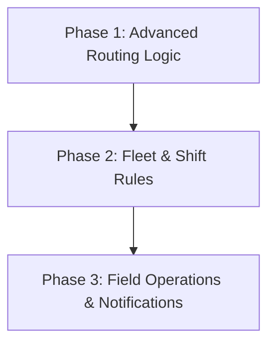

# NAMI vs. OptimoRoute: Feature Gap & Comparison Analysis

This document provides a comparative analysis between **NAMI** (our AI-driven VRPTW research and dispatch platform) and **OptimoRoute** (a leading enterprise-grade field service and route optimization software). It highlights key differences in capabilities and outlines the feature gaps that need to be addressed to transition NAMI from a research-focused solver to a production-ready dispatch tool.

---

## 1. Feature Matrix Comparison

| Feature Category | NAMI (Current State) | OptimoRoute (Production Standard) | Gap Level |
| :--- | :--- | :--- | :--- |
| **Optimization Core** | DRL (DDQN) + Meta-heuristics (ALNS). Handles classic VRPTW. | Meta-heuristics & Genetic Algorithms. Handles complex real-world variants. | Moderate |
| **Fleet Capabilities** | Homogeneous fleet (uniform capacity & cost model). | Heterogeneous fleet (varying capacities, speeds, and cost profiles). | **High** |
| **Driver & Shift Rules** | Static vehicle count. No breaks or shift windows. | Driver working hours, shift windows, lunch breaks, and overtime limits. | **High** |
| **Stop Constraints** | Lat/Lng coordinates, single Time Window, Demand, Service Time. | Multi-time windows, priority levels, skill/certification matching, multi-day scheduling. | **High** |
| **Advanced Logistics** | Depot-to-customer deliveries only. | Pick-up & Delivery (PDP), reload trips, multi-depot setups. | **High** |
| **Field Operations** | Front-end simulation player only. | Mobile driver app, proof of delivery (signatures, photos), live GPS tracking. | **High** |
| **Customer Experience** | None. | Live ETA tracking page, SMS & email notifications. | **High** |

---

## 2. Core Feature Gaps Detailed

### A. Fleet & Driver Management
OptimoRoute is built around individual driver schedules, whereas NAMI models vehicles as identical entities:
* **Heterogeneous Vehicles:** OptimoRoute allows defining distinct vehicle capacities (by weight, volume, or pallet spaces). NAMI currently models a single, uniform capacity dimension (`capacity: 120`).
* **Shift Calendars & Breaks:** OptimoRoute schedules driver shift starts/ends and automatically plans mandatory rest breaks (e.g., 30-minute lunch breaks). NAMI vehicles run continuously.
* **Varying Start/End Locations:** OptimoRoute handles drivers starting from home and ending at different locations. NAMI assumes all routes originate and terminate at the single Depot node.

### B. Order & Stop Constraints
NAMI supports classic time windows, but lacks several key attributes used in commercial scheduling:
* **Multi-Time Windows:** OptimoRoute allows customers to specify multiple delivery slots (e.g., 08:00–12:00 OR 14:00–17:00). NAMI only supports a single `[ready, due]` window.
* **Priority-Based Dispatch:** High-priority orders are guaranteed delivery first, even if it results in slightly longer total routes.
* **Skill Matching:** Certain stops require drivers with specific certifications (e.g., hazardous material handling or installation skills). OptimoRoute filters vehicles accordingly.

### C. Advanced Routing Scenarios
* **Reload Trips:** If total demand exceeds the active fleet capacity, OptimoRoute schedules a driver to return to the depot mid-route, reload, and set off again. NAMI forces all demand to fit in one trip per vehicle.
* **Multi-Depot VRP:** OptimoRoute allows starting routes from multiple depots/warehouses. NAMI is restricted to a single depot.
* **Pickup and Delivery (PDP):** OptimoRoute supports loading cargo at node A and discharging it at node B. NAMI only models outward distribution.

### D. Dispatch & Field Operations
This is the largest operational gap:
* **Mobile Driver App:** OptimoRoute provides a dedicated app where drivers see their queue, navigate using Google/Waze, update stop statuses (completed/failed), and collect Proof of Delivery (signatures/photos).
* **Live GPS Telemetry:** Real-time tracking allows dispatchers to see driver locations on a live map and automatically recalculate ETAs if someone is stuck in traffic.
* **Dynamic Re-optimization:** If new urgent orders arrive mid-day, OptimoRoute recalculates routes on the fly without disrupting already completed stops.

---

## 3. Recommended Roadmap to Bridge the Gap

To evolve NAMI toward commercial usability, we recommend a three-phase approach:

### Phase 1: Advanced Routing Logic (Backend Core)
* Add support for **multi-dimensional capacity constraints** (e.g., separate weight and volume attributes).
* Extend the cost function in `core.py` to support **priority weighting** for high-importance stops.
* Update the ALNS operators to support **multiple depots** and check return times to the depot within a custom shift horizon.

### Phase 2: Fleet & Shift Rules (Frontend & API)
* Build out the currently blank **Fleet Config** tab in `app.html` to support configuring individual vehicles with custom speeds, capacities, and driver names.
* Add **shift hours** and **break durations** to the fleet configuration model.

### Phase 3: Field Operations (Integrations)
* Implement a simple webhook or API endpoint that updates stop statuses (`pending`, `en_route`, `completed`, `failed`) based on external triggers.
* Integrate a mock SMS notification panel to simulate sending arrival alerts to customers when a simulated vehicle enters the service radius.
